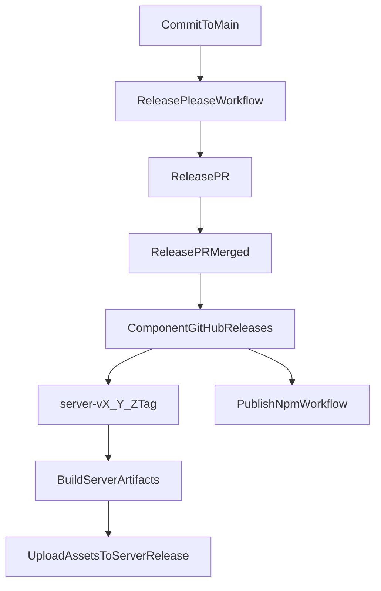

# Release-please Monorepo Migration Plan

## What will be implemented

- Introduce release-please manifest-based configuration for these components:
  - Rust server at `[services/server/Cargo.toml](services/server/Cargo.toml)`
  - JS client at `[packages/client-js/package.json](packages/client-js/package.json)` (independent releases)
  - TUI group at `[apps/tui/package.json](apps/tui/package.json)` + all platform packages under `[apps/tui/packages](apps/tui/packages)`
- Keep non-server GitHub releases (no binary assets), but upload compiled binaries only to `server-vX.Y.Z` releases.
- Publish npm packages only when release-please marks them released, using trusted publishing and `npm publish --provenance` with latest npm CLI.

## Planned file changes

- Add `[release-please-config.json](release-please-config.json)`
  - Configure monorepo packages and release types.
  - Enable component-prefixed tags so server tags are `server-vX.Y.Z`.
  - Add linked-version behavior for TUI packages so if one TUI package releases, all TUI packages release together.
- Add `[.release-please-manifest.json](.release-please-manifest.json)`
  - Seed current versions from existing package manifests.
- Add `[.github/workflows/release-please.yml](.github/workflows/release-please.yml)`
  - Run release-please on `main` to create/update release PRs and publish GitHub releases.
- Replace/split current logic from `[.github/workflows/release.yml](.github/workflows/release.yml)`
  - Remove TUI binary upload + direct npm token publishing from tag workflow.
  - Keep only server artifact build/upload behavior on `server-v*` tags.
- Add `[.github/workflows/publish-npm.yml](.github/workflows/publish-npm.yml)`
  - Trigger from release-please outputs/releases.
  - Detect which components were released and publish only those npm packages.
  - If any TUI component is released, publish all 5 TUI packages in correct order.
  - Use OIDC trusted publishing (`permissions: id-token: write`) and latest npm before publish.

## Release flow after migration

## Existing behavior to explicitly replace

- Current workflow trigger is generic tag pattern in `[.github/workflows/release.yml](.github/workflows/release.yml)`: `on.push.tags: 'v*'`.
- Current workflow also uploads TUI binaries and does token-based npm publish in the same release workflow; this will be separated and replaced by release-please + trusted publish workflow.

## Validation checklist

- Dry-run release-please config check by opening a release PR from a test conventional commit.
- Confirm generated tags include `server-v*` and component-prefixed npm package tags.
- Confirm server release gets only server binary assets.
- Confirm non-server releases have no attached binaries.
- Confirm npm publish job runs only for released packages and always uses `--provenance`.
- Confirm TUI release event publishes all TUI packages together, even if only one changed.

