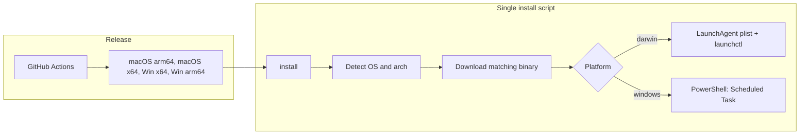

# Bizi server deployment (Windows + macOS)

## Current state

- **Server**: Rust binary (`[services/server/src/main.rs](services/server/src/main.rs)`), built with `cargo build -p bizi`. CLI: `--address` (default `0.0.0.0`), `--port` (default `7436`). Database: SQLite at `bizi.db` in the process **working directory** (no CLI option).
- **Clients**: TUI uses `localhost:7436` (`[apps/tui/src/index.tsx](apps/tui/src/index.tsx)`); no discovery logic.
- No existing install scripts or CI/release workflow.

---

## 1. Release artifacts (GitHub Actions → GitHub Release)

Use GitHub Actions to build the server and attach binaries to a **GitHub Release**.

- **Trigger**: On push of a version tag (e.g. `v0.1.0`) or when a release is created.
- **Build targets**:
  - **macOS**: `aarch64-apple-darwin`, `x86_64-apple-darwin`
  - **Windows**: `x86_64-pc-windows-msvc`, `**aarch64-pc-windows-msvc**` (Windows ARM)
- **Workflow**: Build each target with `cargo build -p bizi --release`, then use `softprops/action-gh-release` (or the GitHub `release` API) to upload the binaries as release assets. Asset names should be predictable so install scripts can pick the right one (e.g. `bizi-server-aarch64-apple-darwin`, `bizi-server-x86_64-pc-windows-msvc.exe`, `bizi-server-aarch64-pc-windows-msvc.exe`).

---

## 2. Database = working directory (remove `--database-url` from CLI)

The server will use the database at **whatever directory the binary is running in** (current working directory). No CLI option for DB path.

- **Server change**: In `[services/server/src/main.rs](services/server/src/main.rs)`, remove the `--database-url` argument and hardcode the DB URL as `sqlite://bizi.db?mode=rwc` (relative to CWD).
- **Data directory**: So that the background service keeps the DB in a fixed place, the **install script** (and service config) sets the process **working directory** to a standard data dir. The server then creates `bizi.db` there automatically.
  - **macOS**: WorkingDirectory = `~/Library/Application Support/bizi`
  - **Windows**: Start-in / WorkingDirectory = `%LOCALAPPDATA%\bizi`

---

## 3. One script for all platforms (same command everywhere)

Use a **single bash install script** (same URL for everyone; script detects OS/arch). See [OpenCode install](https://raw.githubusercontent.com/anomalyco/opencode/refs/heads/dev/install) for the pattern. One command: `curl -fsSL .../install | bash`. On Windows users run it in Git Bash or WSL. Optional: `--version`, `--binary`. Below: platform details that live inside this one script.

Single entrypoint per platform (legacy wording): one script users run (e.g. download and execute), which (1) fetches or verifies the binary, (2) places it, (3) creates the data dir, (4) installs the “run as background task” mechanism.

### macOS: launchd (LaunchAgent)

- **One command**: Users run a single root script: `curl -fsSL https://raw.githubusercontent.com/.../main/install.sh | sh` (or `./install.sh` if they cloned the repo). No need to choose between scripts — this is the only install command for macOS.
- **Steps**:
  1. Detect arch (e.g. `uname -m`), download matching binary from GitHub Releases (or from a fixed URL you control).
  2. Install binary to e.g. `/usr/local/bin/bizi-server` (or `~/.local/bin` if you want no sudo).
  3. Create data dir: `mkdir -p "$HOME/Library/Application Support/bizi"`.
  4. Install LaunchAgent plist to `~/Library/LaunchAgents/com.getbizi.server.plist` that:
    - Sets `WorkingDirectory` to the data dir so the server creates `bizi.db` there.
    - Runs the binary with args: `--address 0.0.0.0 --port 7436`.
    - Uses `RunAtLoad true` and `KeepAlive true` (or `KeepAlive` with successful exit only, depending on desired restart behavior).
    - Optionally sets `StandardOutPath` / `StandardErrorPath` in the data dir for logs.
  5. Load the agent: `launchctl load ~/Library/LaunchAgents/com.getbizi.server.plist`.

Uninstall: unload the agent, delete plist, optionally remove binary and data dir (document in README).

### Windows: background task options

- **Option 1 – Task Scheduler (simplest, no extra tools)**  
  - **One command**: Users run a single root script: `irm https://raw.githubusercontent.com/.../main/install.ps1 | iex` (or `.\install.ps1` if they cloned the repo). No need to choose between scripts — this is the only install command for Windows.
  - Steps: (1) Detect arch (e.g. AMD64 vs ARM64) and download matching exe from GitHub Release to e.g. `%LOCALAPPDATA%\bizi\bin\bizi-server.exe`. (2) Create data dir `%LOCALAPPDATA%\bizi`. (3) Create a scheduled task that runs at user logon, with **working directory** set to the data dir and action: run exe with args `--address 0.0.0.0 --port 7436`. (4) Optionally set “Run with highest privileges” to false and “Run whether user is logged on or not” to false so it’s a user-level task.
  - Limitation: runs when user is logged in; no automatic restart on crash unless you add a wrapper or a second task.
- **Option 2 – NSSM (Windows “service” with restart)**  
  - Install script: download exe + NSSM (or assume NSSM is installed), then `nssm install BiziServer "<path>\bizi-server.exe" "--address 0.0.0.0 --port 7436"`, with AppDirectory set to the data dir so the DB is created there. Gives a real service that restarts on failure.
  - Slightly more moving parts (NSSM download or dependency) but one-command is still feasible.

Recommendation: start with **Task Scheduler** for true one-command install with zero extra dependencies; add NSSM (or WinSW) later if you want a service that survives logout or restarts on crash.

---

## 4. Suggested repo layout and scripts

- **CI**: `.github/workflows/release.yml` triggered on release (e.g. tag `v*`) to build server for macOS (arm64 + x64) and Windows (x64 + arm64), then attach binaries to the GitHub Release. Asset names must match the install script's mapping (e.g. `bizi-server-aarch64-apple-darwin`, `bizi-server-x86_64-pc-windows-msvc.exe`, etc.).
- **Single install script** — one file, one URL, same command for all users:
  - `**install**` or `**install.sh**` (repo root): One bash script that (1) parses optional `--version`, `--binary`, `--help`, (2) detects OS and arch (darwin/windows + arm64/x64), (3) downloads the matching binary from GitHub Releases (or uses `--binary`), (4) installs the binary and sets up the background service (launchd on macOS, Task Scheduler on Windows via PowerShell invoked from bash). No separate install.ps1; Windows users run the same script in Git Bash or WSL.
- **README**: One install command; note that on Windows, use Git Bash or WSL. Document uninstall steps and that the TUI/client expects the server on `localhost:7436`.

---

## 5. Optional: config file for port

To avoid hardcoding port in plist/scheduled task, you could later add a small config file (e.g. in the data dir) that the server reads. For the first version, hardcoding port 7436 in the install script and plist/task is acceptable.

---

## Summary diagram

---

## Implementation order

1. **Server**: Remove `--database-url` from CLI in `main.rs`; hardcode `sqlite://bizi.db?mode=rwc`.
2. **GitHub Actions**: Add `.github/workflows/release.yml` that triggers on release (e.g. tag `v*`), builds server for macOS (aarch64, x86_64) and Windows (x86_64, aarch64), and uploads binaries to the GitHub Release.
3. Add **single `install` script** (bash): OS/arch detection (darwin/windows, arm64/x64; Rosetta-aware on macOS), optional `--version` and `--binary`, download from GitHub Releases, then branch: on darwin install binary + LaunchAgent with WorkingDirectory = data dir and load it; on windows install binary to data dir and call PowerShell to create a scheduled task (working dir = data dir, same server args). Same command for all users: `curl -fsSL .../install | bash`.
4. Update README with the one install command, note for Windows (Git Bash or WSL), and uninstall steps.

