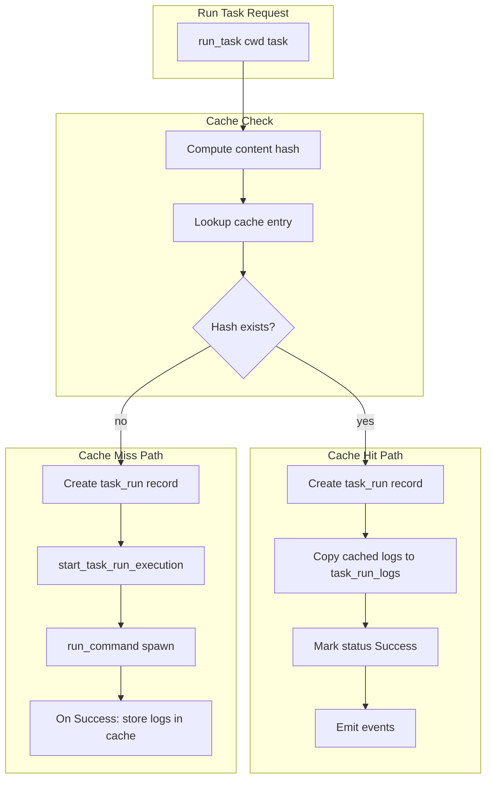

# Task Caching Implementation Plan

## Context

The bizi server runs tasks via `[run_task](crates/bizi-server/src/api/tasks.rs)` which creates a `task_run` record, then `start_task_run_execution` spawns a shell command. Logs are stored in `task_run_logs`. The server has filesystem access to the workspace at `cwd` (client-provided path like `/Users/johndoe/documents/github/example-project`).

## Turborepo-Style Caching Model

- **Content hash**: A fingerprint of all inputs that affect task output (files, env, command, config)
- **Cache key**: `(task_key, cwd, content_hash)` uniquely identifies a run
- **Cache hit**: Restore logs from cache, mark run as Success, skip execution
- **Cache miss**: Run normally, after Success store logs in cache

## Architecture




## Key Design Decisions

### 1. Cache Storage

**Option A: SQLite table** (recommended for v1)

- New `task_run_cache` table: `(cache_key TEXT PK, run_id TEXT, created_at INTEGER)`
- Logs already exist in `task_run_logs` linked by `run_id`
- Cache key = content hash; we store which `run_id` produced that hash so we can copy its logs

**Option B: Filesystem directory** (e.g. `{cwd}/.bizi/cache/`)

- Store artifacts as `{hash}.json` (logs) or `{hash}/` (logs + future outputs)
- Pro: Simple, no schema change; Con: Cache is workspace-local, harder to share

**Recommendation**: Option A. Reuses existing log storage, keeps cache co-located with DB. A separate filesystem cache dir could be added later for output artifacts (Turborepo-style).

### 2. Content Hash Inputs


| Input                                  | Scope    | Example                                                  |
| -------------------------------------- | -------- | -------------------------------------------------------- |
| `task.config.json` (resolved for task) | Global   | Command, cwd, dependsOn                                  |
| `task_key`                             | Per-task | `lint`, `dev:packages`                                   |
| `command`                              | Per-task | `pnpm lint`                                              |
| Effective cwd                          | Per-task | workspace root or task.cwd (e.g. `./crates/bizi-server`) |
| Input files                            | Per-task | Files under effective cwd (glob-based)                   |
| Lockfiles                              | Global   | `pnpm-lock.yaml`, `Cargo.lock` at workspace root         |


**New config fields** (extend [task.config schema](apps/www/static/schemas/task.config.json) and [Task struct](crates/bizi-server/src/config/mod.rs)):

```json
{
  "tasks": {
    "lint": {
      "command": "pnpm lint",
      "cache": true,
      "inputs": ["src/**", "package.json"]
    }
  }
}
```

- `cache` (bool, default `true`): Enable caching for this task
- `inputs` (string[], optional): Glob patterns relative to effective cwd. Default: all files under effective cwd (excluding `.git`, `node_modules`, `.bizi`)
- `globalDependencies` (string[], optional): Root-level paths that invalidate all tasks when changed (e.g. `[".env", "pnpm-lock.yaml"]`)

### 3. Hash Computation

- Use **SHA-256** (via `sha2` crate) or **xxHash** (faster, `xxhash-rust`)
- Walk files matching input globs; for each file: `path + mtime + size` or `path + content` (content is more reliable for cross-machine cache)
- Sort paths for determinism
- Include: task command, effective cwd, global deps content, inputs content

Pseudocode:

```rust
fn compute_task_hash(cwd: &Path, task: &Task, config: &Config) -> String {
    let mut hasher = Sha256::new();
    hasher.update(task.command.as_ref().unwrap_or(&"".into()));
    hasher.update(resolve_effective_cwd(cwd, task).to_string_lossy().as_bytes());
    for path in glob_and_read(global_deps) { hasher.update(&path_content); }
    for path in glob_and_read(task.inputs.unwrap_or_default_globs()) { hasher.update(&path_content); }
    hex(hasher.finalize())
}
```

### 4. Integration Points


| Location                                                          | Change                                                                                                                                                                     |
| ----------------------------------------------------------------- | -------------------------------------------------------------------------------------------------------------------------------------------------------------------------- |
| `[create_task_run](crates/bizi-server/src/api/tasks.rs)`          | Before `start_task_run_execution`, if task has `cache: true`, compute hash and check cache. On hit: create run, copy logs, set Success, return. On miss: proceed as today. |
| `[start_task_run_execution](crates/bizi-server/src/api/tasks.rs)` | No change to core logic. After `run_command` returns Success, call new `store_cache_entry(state, run_id, cache_key)`                                                       |
| New module `crates/bizi-server/src/cache/`                        | `hash.rs` (hash computation), `storage.rs` (DB or filesystem), `mod.rs`                                                                                                    |


### 5. Effective CWD

Tasks can specify `cwd` (e.g. `./crates/bizi-server`). Resolve as `Path::new(workspace_cwd).join(task.cwd.as_ref().unwrap_or("."))` and canonicalize. Use this for both command execution (if not already) and input globbing.

### 6. Cache Invalidation

- **Automatic**: Hash changes when any input file changes
- **Manual**: Add `--force` / `force: true` to StartTaskRequest to bypass cache lookup (run always, optionally still write cache on success)
- **TTL** (optional): Evict cache entries older than N days to limit DB size

### 7. Dependency-Aware Caching

When task B `dependsOn` task A, B's hash should logically include A's output. For **log-only** caching (no file outputs yet), we can either:

- **Simple**: Only hash B's inputs; cache hit means "same inputs, so same result"
- **Strict**: Include A's cache key in B's hash so B invalidates when A's result changes (e.g. A produces generated files B reads)

For v1, **Simple** is sufficient since most tasks (lint, check) don't consume sibling outputs; generated files are usually in git or produced by a separate generate task.

### 8. Subtasks and Optional Tasks

Each subtask run (e.g. `dev:packages`) gets its own cache key. `include_tasks` affects which optional subtasks run but not the hash of a given task—each has its own inputs.

## Implementation Order

1. **DB migration**: Add `task_run_cache` table `(cache_key TEXT PRIMARY KEY, run_id TEXT, created_at INTEGER)`
2. **Config**: Add `cache`, `inputs`, `globalDependencies` to Task and Config; update schema
3. **Cache module**: Implement `compute_task_hash` (with globbing, exclude list) and `lookup_cache` / `store_cache`
4. **Resolve effective cwd**: Add helper and use for hash + command (if task.cwd exists)
5. **Wire into create_task_run**: Cache check before execution; on hit, create run + copy logs + Success
6. **Wire into run_command completion**: On Success, store cache entry
7. **API**: Add `force` to StartTaskRequest for cache bypass
8. **Testing**: Unit tests for hash determinism, cache hit/miss flows

## Files to Create/Modify


| File                                                                            | Action                      |
| ------------------------------------------------------------------------------- | --------------------------- |
| `crates/bizi-server/src/db/migration/m20260227_000003_create_task_run_cache.rs` | New migration               |
| `crates/bizi-server/src/db/entities/task_run_cache.rs`                          | New entity                  |
| `crates/bizi-server/src/cache/mod.rs`                                           | New module                  |
| `crates/bizi-server/src/cache/hash.rs`                                          | Hash computation            |
| `crates/bizi-server/src/cache/storage.rs`                                       | DB read/write               |
| `crates/bizi-server/src/config/mod.rs`                                          | Add Task fields             |
| `crates/bizi-server/src/api/tasks.rs`                                           | Integrate cache check/store |
| `apps/www/static/schemas/task.config.json`                                      | Add cache/inputs schema     |


## Open Questions

1. **Default inputs**: All files under effective cwd, or only common source patterns (`**/*.{ts,tsx,js,rs,json}`) to avoid over-invalidating on docs/images?
2. **Environment variables**: Include in hash? Turborepo's `globalEnv` / `env` can invalidate. Start without; add later if needed.
3. **Concurrent runs**: Same task + same hash run concurrently—both miss cache, both run. Acceptable for v1; could add locking to dedupe.

